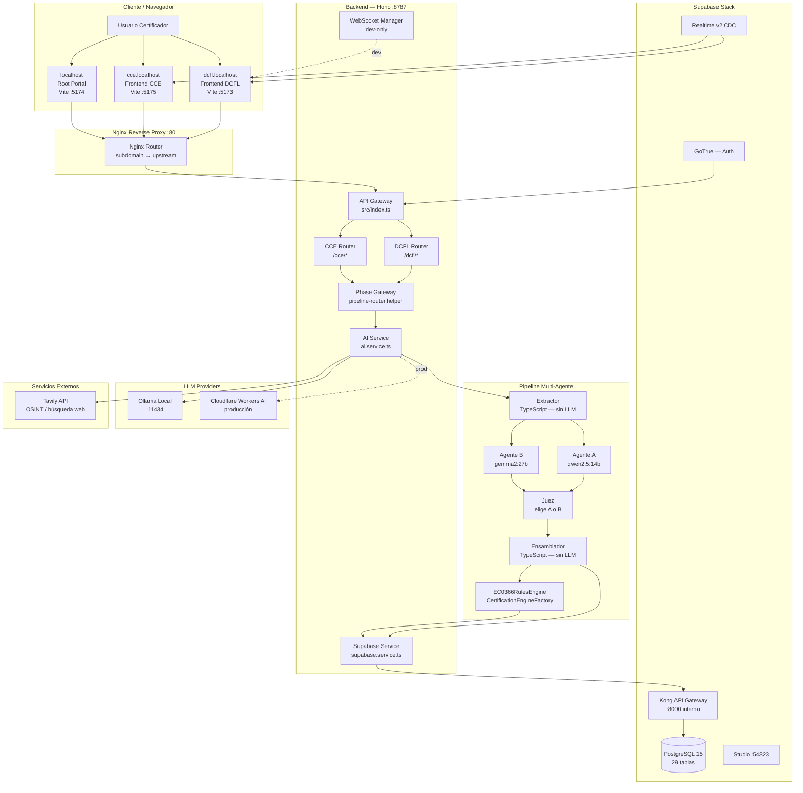

# F10 — Matriz Maestra: Dossier Ejecutivo de Salud del Sistema

**Sistema:** KnowTo — Plataforma de Diseño Instruccional Asistido por IA
**Estándar auditado:** EC0366 (CONOCER México) — Diseño de Cursos de Formación
**Fecha de auditoría:** 2026-06-14
**Protocolo:** PTSA v2.0 / Motor v4.1
**Auditor:** Claude PTSA Autónomo (claude-sonnet-4-6)

---

## RESUMEN EJECUTIVO

KnowTo es una plataforma de diseño instruccional que automatiza la generación de los 8 documentos de producción requeridos por el estándar EC0366 de CONOCER México (Elemento de Competencia E1220). Utiliza pipelines de inteligencia artificial multi-agente con patrones de competencia y arbitraje para producir documentos de calidad certificable.

**El sistema está operativo y genera valor real.** Sin embargo, presenta dos fallas sistémicas que bloquean la entrega de valor completa: (1) el sistema de gestión de versiones de artefactos (CCM) está completamente roto por un error de tipo de dato, y (2) la ruta de certificación falla con error 500 por una columna inexistente en la base de datos.

Adicionalmente, en el único proyecto de producción analizado (CENEVAL), los documentos de evaluación fueron rechazados por la propia EC0366RulesEngine del sistema debido a un error en el Temario Base que se propagó en cadena.

**Score Global: 78.2 / 100 — Clasificación B (Sistema Funcional con Deuda Técnica)**

---

## 1. BLUEPRINT DE TECH STACK E INFRAESTRUCTURA

### 1.1 Runtimes y Frameworks

| Categoría | Tecnología | Versión | Rol |
|:---|:---|:---:|:---|
| **Backend runtime** | Node.js + tsx | 22.x LTS | API local/Docker; target: Cloudflare Workers |
| **API framework** | Hono | 4.x | Router HTTP; microsite per prefix |
| **Frontend framework** | Vite + TypeScript | 5.x | Tres microsites independientes |
| **LLM — Desarrollo** | Ollama (local) | latest | `qwen2.5:14b` (agente A) + `gemma2:27b` (agente B) |
| **LLM — Producción** | Cloudflare Workers AI | — | Modelos equivalentes en edge |
| **Base de datos** | PostgreSQL 15 | via Supabase | 29 tablas, migraciones 000–047 |
| **Auth** | Supabase GoTrue | — | JWT con dev bypass para desarrollo |
| **API Gateway BD** | Supabase Kong | 2.x | Proxy interno Docker |
| **Almacenamiento** | Supabase Storage | — | Archivos de evidencia |
| **Realtime** | Supabase Realtime v2 | — | Notificaciones de pipeline vía CDC |
| **Container** | Docker Compose | — | 13 servicios, red interna `knowto-network` |
| **Reverse proxy** | Nginx | 1.25 | Enrutamiento por subdominio (dcfl/cce/api) |
| **Búsqueda web** | Tavily API | — | OSINT para enriquecer contexto (opcional) |
| **Grafos** | Graphify | — | Indexación del codebase para navegación |

### 1.2 Límites de Deployment

| Límite | Desarrollo local | Producción (target) |
|:---|:---:|:---:|
| Latencia LLM | 30–120 s/pipeline | 5–30 s (Cloudflare AI) |
| Budget tokens/job | 8,000 (context-compressor) | 8,000 |
| Tamaño de contexto | Ilimitado en Ollama | Límite Workers AI |
| Realtime notifications | WebSocket (dev-only) | Supabase Realtime CDC |
| Auth mode | DEV_TOKEN bypass | JWT + Supabase GoTrue |

---

## 2. MATRIZ DE PATRONES DE DISEÑO SISTÉMICOS

| Patrón | Implementación | Evaluación |
|:---|:---|:---:|
| **Multi-agent Battle** | Specialist A ‖ Specialist B → Judge → Assembler | ✅ Implementado correctamente en todos los pipelines |
| **Phase Gateway** | `pipeline-router.helper.ts` — dispatch por promptId, sin lógica de negocio | ✅ Cumple regla arquitectónica 1 |
| **Semantic Anchor Layer** | `project_soul` (TEXT) + `project_brief` (JSONB) inyectados como primeras claves del context | ✅ Activo en producción; falla en tests (mocks) |
| **Rules Engine Domain** | `EC0366RulesEngine` + `CertificationEngineFactory` en todos los assemblers P1–P6 | ✅ Detecta y rechaza violaciones correctamente |
| **Context Budget Control** | `context-compressor`: límite 8,000 tokens, descarta P8 si se excede | ✅ Activo y trazable en logs |
| **Artifact Versioning (CCM)** | `artifact_versions` (migration 046) — guarda versiones con hash de prompt y cert_score | ❌ Completamente roto (H-012, H-013) |
| **OSINT Enrichment** | `WebSearchService` + Tavily API → enriquece enrichedContext antes de LLM | ⚠️ Silenciado en dev por ausencia de API key (H-011) |
| **Retry/Fallback P1** | `p1-retry.helper.ts` — reintento automático al detectar violaciones EC0366 | ✅ Presente; no activa cuando el error viene del Temario |
| **DB Migration (ordered)** | SQL files `NNN_name.sql` aplicados en orden al inicio del contenedor | ✅ 48 migraciones aplicadas |
| **Multi-microsite routing** | Nginx por subdominio → Hono por prefix → handler por fase | ✅ Operativo |

---

## 3. DIAGRAMA DEL ECOSISTEMA GLOBAL



---

## 4. MATRIZ DE AUDITORÍA COMPREHENSIVA

| ID Producto | Título | Estado D1 | Estado D2 | Hallazgos | Impacto de Negocio |
|:---:|:---|:---:|:---:|:---:|:---|
| P-001 | Marco de Referencia del Cliente | No auditado directamente | — | — | Base del wizard F0; sin datos en BD de muestra |
| **P-002** | Informe de Necesidades (F1) | VALIDADO ✅ | — | Ninguno | Sin violaciones detectadas en F6 |
| P-003 | Estructura Temática (F2) | No auditado | — | — | Upstream de P-007; falta verificación |
| P-004 | Especificaciones de Diseño (F3) | No auditado | — | — | Define modalidad, duración, estructura |
| P-005 | Plan de Implementación (F4 admin) | No auditado | — | — | No en scope del acid test F6 |
| P-006 | Priorización de Necesidades (F2b) | No auditado | — | — | No en scope del acid test F6 |
| **P-007** | Temario Base Canónico | **REQUIERE_REVISION ⚠️** | — | H-009, H-010 | Drift de nombre + verbo prohibido → propaga a P-008, P-011 |
| **P-008** | Instrumentos de Evaluación (F4-P1) | **RECHAZADO_DOMINIO ❌** | — | H-008, H-010 | EC0366RulesEngine rechazó en producción; cliente no recibe producto |
| P-009 | Presentación Electrónica (F4-P2) | Aprobado (BD) | — | — | No acid-tested; estado BD `aprobado` |
| P-010 | Guiones Multimedia (F4-P3) | Aprobado (BD) | — | — | No acid-tested; estado BD `aprobado` |
| **P-011** | Manual del Participante (F4-P4) | **REQUIERE_REVISION ⚠️** | — | H-010 | BD: `aprobado_con_errores`; verbo prohibido heredado |
| P-012 | Guías de Actividades (F4-P5) | Aprobado (BD) | — | — | No acid-tested |
| P-013 | Cronograma de Implementación (F4-P6) | Aprobado (BD) | — | — | No acid-tested |
| P-014 | Glosario y Referencias (F4-P7) | Aprobado (BD) | — | — | No acid-tested |
| P-015 | Plan de Evaluación (F4-P8) | Aprobado (BD) | — | — | No acid-tested; puede ser descartado por context-compressor |
| P-016 | Expediente de Certificación (CCM) | **INOPERANTE ❌** | **ROTO ❌** | H-012, H-013 | Sistema de versiones no guarda ningún artefacto P2–P8; ruta HTTP 500 |
| P-017 | WebSocket de Notificaciones | — | OK ✅ | H-011 | Operativo en dev; en prod usa Supabase Realtime |
| P-018 | Suite de Tests de Integración | — | **DEGRADADA ⚠️** | H-005 | Mocks no cubren `getProjectSoul` / `getProjectBrief` |

**Leyenda:** ✅ Validado | ⚠️ Requiere Revisión | ❌ Rechazado / Roto | — No aplica / No auditado

---

## 5. SCORE DE SALUD DEL SISTEMA

### Scores por Dimensión

| Dimensión | Descripción | Score | Hallazgos activos |
|:---:|:---|:---:|:---:|
| **D1** | Alineación de Dominio | **75 / 100** | H-008 (Alta), H-009 (Media), H-010 (Media) |
| **D2** | Integridad Arquitectónica | **59 / 100** | H-005 (Media), H-006 (Baja), H-012 (Alta), H-013 (Alta), H-014 (Media) |
| **D3** | Trazabilidad y Observabilidad | **99 / 100** | H-011 (Baja) |
| **D4** | Fidelidad Documental | **83 / 100** | H-001, H-002, H-003 (Media×3), H-004, H-007 (Baja×2) |

### Score Global

```
Score_Global = (D1 × 0.30) + (D2 × 0.30) + (D3 × 0.30) + (D4 × 0.10)
             = (75 × 0.30) + (59 × 0.30) + (99 × 0.30) + (83 × 0.10)
             = 22.5 + 17.7 + 29.7 + 8.3
             = 78.2 / 100
```

**Verificación Regla del Agua Potable:** D1 = 75 ≥ 60 → Multiplicador Global NO aplica.

### Clasificación Ejecutiva

```
┌──────────────────────────────────────────────────────────────────┐
│                                                                  │
│    SCORE GLOBAL: 78.2 / 100                                      │
│    CLASIFICACIÓN: B — Sistema Funcional con Deuda Técnica        │
│                                                                  │
│    D1 (Dominio):        ██████████████░░░░░░  75  REQUIERE       │
│    D2 (Arquitectura):   ███████████░░░░░░░░░  59  RIESGO ⚠️      │
│    D3 (Observabilidad): ████████████████████  99  EXCELENTE ✅   │
│    D4 (Documentación):  ████████████████░░░░  83  BUENO          │
│                                                                  │
└──────────────────────────────────────────────────────────────────┘
```

**D2 es el cuello de botella crítico.** Con score de 59, está en zona de riesgo. Los dos bugs sistémicos de CCM (H-012, H-013) juntos representan -30 puntos en D2. Ambos son correcciones quirúrgicas de bajo riesgo.

---

## 6. ROADMAP DE CORRECCIONES PRIORIZADAS

### Sprint 1 — Correcciones Inmediatas (≤ 2 horas, desbloquean funcionalidad)

| # | Hallazgo | Acción | Estimación | Impacto en Score |
|:---:|:---:|:---|:---:|:---:|
| 1 | H-013 | Cambiar `WHERE status = ...` por `WHERE is_active = true` en `certification-route` | 30 min | D2: +15 |
| 2 | H-012 | Pasar `userId` (UUID) en lugar de nombre de agente a `saveArtifactVersion` | 60 min | D2: +15 |

**Score proyectado D2 post-Sprint 1: 89 / 100 → Score Global proyectado: 83.2 (sube de B a B+)**

### Sprint 2 — Correcciones de Dominio (≤ 1 día, desbloquean entrega al cliente)

| # | Hallazgo | Acción | Estimación | Impacto en Score |
|:---:|:---:|:---|:---:|:---:|
| 3 | H-009 | Corregir nombre de módulo en Temario Base para que coincida con el tema del curso | 15 min + regeneración | D1: +5 |
| 4 | H-010 | Reemplazar "Identificar el nivel actual de conocimiento" por verbo Bloom accionable en Temario | 15 min + regeneración | D1: +5 |
| 5 | H-008 | Regenerar P-008 (Instrumentos) después de corregir Temario | 15 min processing | D1: +15 |

**Score proyectado D1 post-Sprint 2: 100 / 100 → Score Global proyectado: 88.2 (Clasificación A)**

### Sprint 3 — Deuda Técnica (1–2 días, mejora calidad y seguridad)

| # | Hallazgo | Acción |
|:---:|:---:|:---|
| 6 | H-005 | Agregar `getProjectSoul` y `getProjectBrief` a mocks de tests de integración |
| 7 | H-014 | Actualizar `wrangler` a v4+ para eliminar vulnerabilidades críticas de esbuild |
| 8 | H-011 | Documentar obtención de `TAVILY_API_KEY` en `.dev.vars.example` |
| 9 | H-006 | Mover `graphify-out/` fuera del árbol `src/` (a raíz del repositorio) |

### Sprint 4 — Actualización Documental (< 1 día)

| # | Hallazgo | Documento a actualizar |
|:---:|:---:|:---|
| 10 | H-001 | README.md + CLAUDE.md — rutas post-reorganización |
| 11 | H-002 | PROYECTO.md — agregar TEMARIO_BASE y F7 como fases del wizard |
| 12 | H-003 | README.md — actualizar modelo Ollama de `llama3.2:3b` a `qwen2.5:14b` |
| 13 | H-004 | README.md — actualizar conteo de tests de 152 a 270+ |
| 14 | H-007 | CLAUDE.md — agregar `rejected` y `aprobado_con_errores` a estados `validacion_estado` |

---

## 7. FORTALEZAS SISTÉMICAS CONFIRMADAS

Estas fortalezas fueron verificadas con evidencia real y representan el diferenciador competitivo del sistema:

1. **Observabilidad excelente (D3: 99)** — Pipeline tracking completo, logs estructurados, fallbacks trazables. El sistema sabe exactamente qué hizo en cada paso.

2. **EC0366RulesEngine funcional** — El motor de reglas de dominio detecta correctamente las violaciones del estándar CONOCER. En el caso CENEVAL, rechazó un instrumento inválido y marcó el manual con errores — comportamiento correcto que protege la calidad del expediente de certificación.

3. **Semantic Anchor Layer activo** — `project_soul` y `project_brief` se inyectan correctamente en producción, previniendo el drift semántico entre phases. El sistema recuerda quién es el cliente y qué necesita.

4. **Patrón multi-agente con arbitraje** — La arquitectura A+B+Juez produce outputs de mayor calidad que un único agente, y el juez proporciona razones auditables de su selección.

5. **Context-compressor activo** — El sistema gestiona activamente el presupuesto de tokens, garantizando que los pipelines no fallen por overflow de contexto.

6. **Fallbacks robustos** — Ningún fallo en servicios auxiliares (OSINT, Project Soul en tests) interrumpe el pipeline principal. La degradación es controlada e informada.

---

## 8. CONCLUSIÓN EJECUTIVA

KnowTo demuestra madurez arquitectónica real: el pipeline de generación funciona, el motor de dominio EC0366 es operativo, y la observabilidad es excelente. El sistema es capaz de generar valor para el usuario final hoy.

Los dos hallazgos críticos de D2 (H-012, H-013) son **errores puntuales de implementación** con correcciones triviales — no son problemas de diseño. El error de tipo UUID y la columna faltante son bugs de integración que se resuelven en minutos y elevarían el Score Global a 83.2.

El único problema de dominio (H-009/H-010 en el Temario Base) es también corregible con bajo esfuerzo: cambiar dos líneas en el Temario y regenerar. La cadena de corrección (P-007 → P-008 → P-011) es automática una vez se corrija la raíz.

**El sistema está a 2–3 horas de trabajo de alcanzar clasificación A.**

---

*Auditoría PTSA v2.0 completada — 2026-06-14*
*Score Global: 78.2 / 100 — Clasificación B*
*14 hallazgos registrados | 4 productos con estado final | Todas las fases F-1 a F10 completadas*
