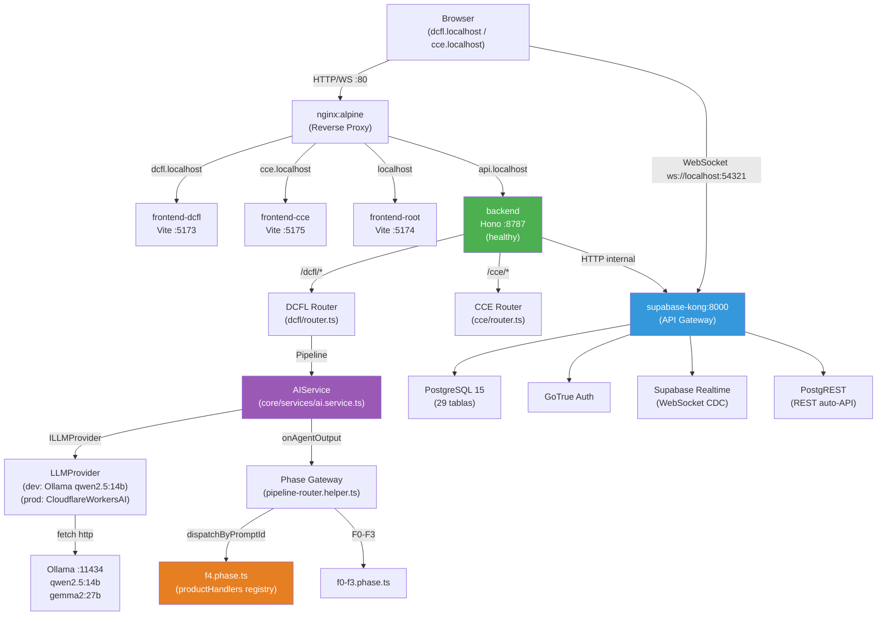
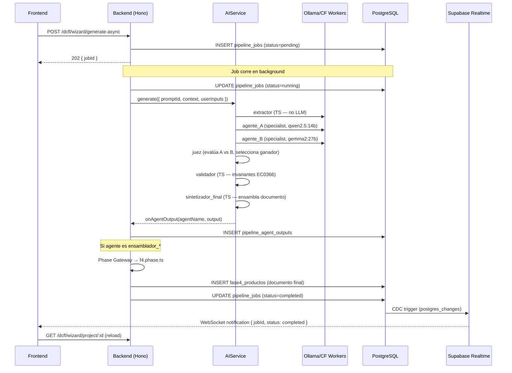
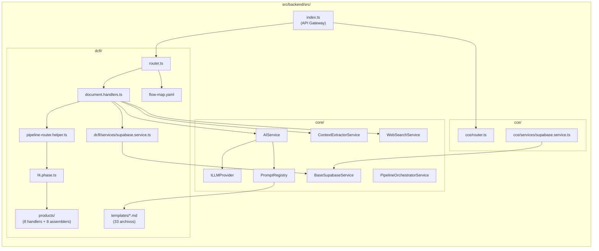

# F1 — Mapa del Sistema

## Update U-001 | Timestamp: 2026-06-13 23:20

---

## 1. Diagrama de Flujo de Requests (Mermaid)

---

## 2. Flujo de Pipeline Multi-Agente (por documento)

---

## 3. Mapa de Dependencias de Módulos

---

## 4. Servicios Core detectados (real vs documentado)

| Servicio | Documentado | Real |
|:---|:---:|:---:|
| AIService | ✅ | ✅ |
| PipelineOrchestratorService | ✅ | ✅ |
| BaseSupabaseService | ✅ | ✅ |
| ContextExtractorService | ✅ | ✅ |
| CrawlerService | ✅ | ✅ |
| UploadService | ✅ | ✅ |
| PromptRegistry | ✅ | ✅ |
| ILLMProvider | ✅ | ✅ |
| **WebSearchService** | ❌ | ✅ (`web-search.service.ts` — usa Tavily API) |
| **PipelineJobsService** | ❌ | ✅ (`pipeline-jobs.service.ts`) |
| **PreguntasService** | ❌ | ✅ (`preguntas.service.ts`) |
| **core/websocket/manager.ts** | ❌ | ✅ (WebSocket manager propio) |

---

## 5. Endpoints reales (verificados via OpenAPI spec)

### DCFL
| Método | Ruta | Documentado |
|:---|:---|:---:|
| GET | `/dcfl/health` | ✅ |
| POST | `/dcfl/wizard/project` | ✅ |
| GET | `/dcfl/wizard/project/:id` | ✅ |
| GET | `/dcfl/wizard/projects` | ✅ |
| POST | `/dcfl/wizard/step` | ✅ |
| POST | `/dcfl/wizard/extract` | ✅ |
| POST | `/dcfl/wizard/generate-async` | ✅ |
| GET | `/dcfl/wizard/job/:jobId` | ✅ |
| POST | `/dcfl/wizard/generate-form` | ✅ |
| GET | `/dcfl/wizard/project/:id/fase1/informe` | ❌ (no en README) |
| GET | `/dcfl/wizard/project/:id/f4-productos` | ❌ (no en README) |
| POST | `/dcfl/test/run-all` | ❌ (test runner interno) |
| DELETE | `/dcfl/test/reset/:projectId` | ❌ (test runner interno) |

**Confidence F1:** 90
