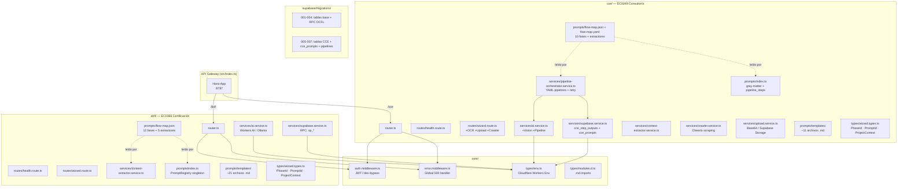

# Análisis de Arquitectura para Unificación — KnowTo

> Generado: 2026-04-13  
> Alcance: Backend multi-microsite (`/dcfl` + `/cce`) → core compartido

---

## 1. Diagrama de arquitectura actual



> **Nota:** Las líneas punteadas representan lectura de archivos en tiempo de ejecución. No existe ninguna importación cruzada entre `dcfl/` y `cce/`.

---

## 2. Tabla de componentes por módulo

| Componente | `core/` | `dcfl/` | `cce/` | Estado de reutilización |
|:---|:---:|:---:|:---:|:---|
| `auth.middleware.ts` | ✅ | — | — | Ya compartido |
| `error.middleware.ts` | ✅ | — | — | Ya compartido |
| `types/env.ts` | ✅ | — | — | Ya compartido |
| `AIService` | — | ✅ | ✅ | **Duplicado** — lógica de LLM idéntica en base, CCE extiende con Vision/pipeline |
| `SupabaseService` | — | ✅ | ✅ | **Duplicado** — base idéntica, CCE agrega métodos de pipeline |
| `ContextExtractorService` | — | ✅ | ✅ | **Idéntico** — copiar/pegar exacto |
| `PromptRegistry` | — | ✅ | ✅ | **Casi idéntico** — CCE agrega `gray-matter` + `pipeline_steps` |
| `CrawlerService` | — | ✗ | ✅ | Solo CCE (hoy), candidato a core |
| `UploadService` | — | ✗ | ✅ | Solo CCE (hoy), candidato a core |
| `PipelineOrchestratorService` | — | ✗ | ✅ | Core del nuevo modelo unificado |
| `flow-map.json/yaml` | — | ✅ | ✅ | **Debe permanecer separado** por estándar |
| `prompts/templates/` | — | ✅ | ✅ | **Debe permanecer separado** por estándar |
| `types/wizard.types.ts` | — | ✅ | ✅ | **Debe permanecer separado** (dominios distintos) |
| `router.ts` | — | ✅ | ✅ | Patrón idéntico, puede parametrizarse |

---

## 3. Lista de dependencias

### 3.1 Dependencias externas clave

| Paquete | Usado en | Propósito |
|:---|:---|:---|
| `hono` + `@hono/zod-openapi` | Global | HTTP framework + validación |
| `@supabase/supabase-js` | dcfl, cce | Cliente Supabase |
| `gray-matter` | cce/prompts | Parseo de YAML frontmatter |
| `cheerio` | cce/crawler | Web scraping |
| `js-yaml` | cce/pipeline | Parseo de YAML para flow-map |
| `uuid` | cce/upload | Generación de IDs |

### 3.2 Importaciones entre módulos

```
dcfl/ → core/   ✅ (Env, authMiddleware)
cce/  → core/   ✅ (Env, authMiddleware)
dcfl/ → cce/    ✗ Ninguna
cce/  → dcfl/   ✗ Ninguna
```

### 3.3 Importaciones dentro de dcfl/

```
routes/wizard.route.ts
  ← services/ai.service.ts
  ← services/supabase.service.ts
  ← services/context-extractor.service.ts
  ← core/middleware/auth.middleware.ts
  ← core/types/env.ts

services/ai.service.ts
  ← prompts/index.ts (getPromptRegistry)
  ← core/types/env.ts

services/context-extractor.service.ts
  ← prompts/flow-map.json (patrones de extracción)
  ← services/ai.service.ts (fallback IA)
```

### 3.4 Importaciones dentro de cce/

```
routes/wizard.route.ts
  ← services/ai.service.ts
  ← services/supabase.service.ts
  ← services/context-extractor.service.ts
  ← services/crawler.service.ts
  ← services/upload.service.ts
  ← core/middleware/auth.middleware.ts

services/ai.service.ts
  ← prompts/index.ts (getPromptRegistry, pipeline_steps)
  ← services/pipeline-orchestrator.service.ts

services/pipeline-orchestrator.service.ts
  ← prompts/flow-map.yaml
  ← services/supabase.service.ts (cce_step_outputs)
  ← services/ai.service.ts (runAgent)
```

---

## 4. Puntos de extensión identificados

| Punto de extensión | DCFL necesita | CCE ya tiene | Acción recomendada |
|:---|:---|:---|:---|
| **Flow-map** | ✅ Definir fases en YAML | ✅ `flow-map.yaml` | Formalizar schema YAML compartido; mantener en `[site]/prompts/` |
| **Prompt registry** | ✅ Migrar a prompts pequeños | ✅ BD `cce_prompts` | Renombrar tabla → `site_prompts(site_id, phase_id, prompt_id, content, metadata)` |
| **Pipeline Orchestrator** | ✅ Adoptar (desde macro-prompts) | ✅ `pipeline-orchestrator.service.ts` | Mover a `core/` sin cambios |
| **Agent templates** | ✅ Reutilizar extractor/specialist/judge | ✅ Tipos en pipeline orchestrator | Extraer a `core/agents/` |
| **Validation rules** | ✅ Jueces por fase | ✅ `output_guard` en pipeline YAML | Configurar en flow-map por fase |
| **Vision / OCR** | Opcional | ✅ `extractTextFromImage()` | Mover a `core/` como feature opcional |
| **Crawler** | Opcional | ✅ `crawler.service.ts` | Mover a `core/` |
| **Upload** | Posible | ✅ `upload.service.ts` | Mover a `core/` |

---

## 5. Componentes a unificar (core compartido propuesto)

### Estructura objetivo: `backend/src/core/`

```
core/
├── middleware/
│   ├── auth.middleware.ts         ← Ya existe
│   └── error.middleware.ts        ← Ya existe
├── types/
│   ├── env.ts                     ← Ya existe
│   ├── modules.d.ts               ← Ya existe
│   └── pipeline.types.ts          ← NUEVO: tipos de flow-map y pipeline
├── services/
│   ├── ai.service.ts              ← MOVER (base + Vision, sin pipeline_steps hardcodeado)
│   ├── supabase.service.ts        ← MOVER (operaciones base, sin prefijo cce_)
│   ├── context-extractor.service.ts ← MOVER (idéntico en ambos)
│   ├── crawler.service.ts         ← MOVER desde cce/
│   ├── upload.service.ts          ← MOVER desde cce/
│   └── pipeline-orchestrator.service.ts ← MOVER desde cce/
├── agents/
│   ├── extractor.agent.ts         ← EXTRAER desde pipeline-orchestrator
│   ├── specialist.agent.ts        ← EXTRAER desde pipeline-orchestrator
│   └── judge.agent.ts             ← EXTRAER desde pipeline-orchestrator
└── prompts/
    ├── registry.ts                ← UNIFICAR ambos PromptRegistry (usar gray-matter)
    └── schema/
        ├── flow-map.schema.json   ← NUEVO: schema JSON Schema para validar flow-maps
        └── prompt.schema.json     ← MOVER desde dcfl/
```

### Interfaces a crear (`core/types/pipeline.types.ts`)

```typescript
export interface FlowMapConfig {
  version: string;
  site_id: string;         // 'dcfl' | 'cce' | futuro
  phases: PhaseNode[];
  extractors: ExtractorNode[];
}

export interface PhaseNode {
  id: string;
  tipo: 'form' | 'generation' | 'extraction';
  label: string;
  prompt_id?: string;
  pipeline_steps?: PipelineStep[];
  salida?: OutputField[];
  next: string | null;
}

export interface PipelineStep {
  type: 'extractor' | 'specialist' | 'judge';
  prompt_id: string;
  output_key: string;
  output_guard?: OutputGuard;
}

export interface SiteConfig {
  site_id: string;
  flow_map: FlowMapConfig;
  prompt_table: string;    // 'site_prompts' con WHERE site_id = ?
}
```

---

## 6. Componentes a mantener separados (por estándar)

| Componente | Ubicación | Razón |
|:---|:---|:---|
| `flow-map.yaml` | `[site]/prompts/flow-map.yaml` | Define el workflow específico del estándar EC |
| `prompts/templates/` | `[site]/prompts/templates/` | Contenido de dominio (EC0366 ≠ EC0249) |
| `types/wizard.types.ts` | `[site]/types/` | `PhaseId`, `PromptId`, `ProjectContext` son específicos del estándar |
| `router.ts` | `[site]/router.ts` | Puede simplificarse a 3 líneas usando factory de core |
| `routes/health.route.ts` | `[site]/routes/` | Solo cambia el `service` name |
| `routes/wizard.route.ts` | `[site]/routes/` | Maneja rutas específicas del flujo del estándar |

---

## 7. Recomendaciones para la unificación

### 7.1 Inyección del flow-map en tiempo de ejecución

El `PipelineOrchestratorService` debe recibir el `SiteConfig` como dependencia en su constructor, no leerlo con `fs.readFileSync` hardcodeado:

```typescript
// ANTES (cce/services/pipeline-orchestrator.service.ts)
const flowMap = yaml.load(fs.readFileSync('./flow-map.yaml'));

// DESPUÉS (core/services/pipeline-orchestrator.service.ts)
export class PipelineOrchestratorService {
  constructor(
    private config: SiteConfig,   // inyectado desde el router del microsite
    private ai: AIService,
    private db: SupabaseService
  ) {}
}
```

El router de cada microsite construye el `SiteConfig` leyendo su propio `flow-map.yaml`:

```typescript
// dcfl/router.ts
import flowMap from './prompts/flow-map.yaml';
const siteConfig: SiteConfig = { site_id: 'dcfl', flow_map: flowMap, ... };
const orchestrator = new PipelineOrchestratorService(siteConfig, ai, db);
```

### 7.2 Base de datos: tabla `site_prompts`

**Migración recomendada:**

```sql
-- 008_unify_prompts_table.sql

-- 1. Crear tabla unificada
CREATE TABLE site_prompts (
  id          uuid PRIMARY KEY DEFAULT gen_random_uuid(),
  site_id     text NOT NULL,           -- 'dcfl', 'cce', futuro
  phase_id    text NOT NULL,
  prompt_id   text NOT NULL,
  content     text NOT NULL,
  metadata    jsonb DEFAULT '{}',      -- pipeline_steps, output_guard, etc.
  version     integer DEFAULT 1,
  active      boolean DEFAULT true,
  created_at  timestamptz DEFAULT now(),
  updated_at  timestamptz DEFAULT now(),
  UNIQUE (site_id, prompt_id, version)
);

-- 2. Migrar datos existentes de cce_prompts
INSERT INTO site_prompts (site_id, phase_id, prompt_id, content, metadata)
SELECT 'cce', phase_id, prompt_id, content, metadata
FROM cce_prompts;

-- 3. Crear índices
CREATE INDEX idx_site_prompts_lookup ON site_prompts (site_id, prompt_id) WHERE active = true;

-- 4. Crear RPC unificada
CREATE OR REPLACE FUNCTION sp_get_prompt(p_site_id text, p_prompt_id text)
RETURNS jsonb LANGUAGE plpgsql AS $$
DECLARE result jsonb;
BEGIN
  SELECT jsonb_build_object('content', content, 'metadata', metadata)
  INTO result
  FROM site_prompts
  WHERE site_id = p_site_id AND prompt_id = p_prompt_id AND active = true
  ORDER BY version DESC LIMIT 1;
  RETURN result;
END; $$;
```

### 7.3 `PromptRegistry` unificado

La clase del registry en `core/prompts/registry.ts` debe aceptar un `site_id` y un `SupabaseService` para resolución dinámica desde BD, con fallback a archivos locales:

```typescript
export class PromptRegistry {
  constructor(
    private siteId: string,
    private db?: SupabaseService,        // si undefined → solo archivos locales
    private localMap?: Record<string, string>  // mapa local de fallback
  ) {}

  async getPrompt(promptId: string): Promise<PromptMetadata> {
    if (this.db) {
      const row = await this.db.getPrompt(this.siteId, promptId);
      if (row) return this.parseFrontmatter(row.content, row.metadata);
    }
    // fallback a archivo local
    const raw = this.localMap?.[promptId];
    if (!raw) throw new Error(`Prompt not found: ${promptId}`);
    return this.parseFrontmatter(raw);
  }
}
```

---

## 8. Plan de migración paso a paso para DCFL

### Fase 0 — Preparación (sin cambios de comportamiento)

| Paso | Acción | Archivos afectados |
|:---|:---|:---|
| 0.1 | Crear rama `feat/unified-core` | — |
| 0.2 | Mover `ContextExtractorService` idéntico a `core/services/` | `dcfl/services/`, `cce/services/`, `core/services/` |
| 0.3 | Actualizar imports en dcfl y cce | `wizard.route.ts` en ambos |
| 0.4 | Verificar tests: `npm test` | `__tests__/` |

### Fase 1 — Unificar SupabaseService

| Paso | Acción | Archivos afectados |
|:---|:---|:---|
| 1.1 | Crear `core/services/supabase.service.ts` con métodos base comunes | Nuevo archivo |
| 1.2 | `dcfl/services/supabase.service.ts` extiende la clase base | `dcfl/services/supabase.service.ts` |
| 1.3 | `cce/services/supabase.service.ts` extiende la clase base | `cce/services/supabase.service.ts` |
| 1.4 | Correr migración `008_unify_prompts_table.sql` en dev | Supabase |
| 1.5 | Agregar `getPrompt(siteId, promptId)` al base service | `core/services/supabase.service.ts` |

### Fase 2 — Mover PipelineOrchestrator a core

| Paso | Acción | Archivos afectados |
|:---|:---|:---|
| 2.1 | Mover `pipeline-orchestrator.service.ts` a `core/services/` | Nuevo path |
| 2.2 | Cambiar a constructor con `SiteConfig` inyectado | `core/services/pipeline-orchestrator.service.ts` |
| 2.3 | Crear `core/types/pipeline.types.ts` con interfaces | Nuevo archivo |
| 2.4 | Actualizar `cce/router.ts` para inyectar `SiteConfig` | `cce/router.ts` |

### Fase 3 — Unificar AIService

| Paso | Acción | Archivos afectados |
|:---|:---|:---|
| 3.1 | Crear `core/services/ai.service.ts` con Workers AI + Ollama + Vision | Nuevo archivo |
| 3.2 | Eliminar `dcfl/services/ai.service.ts` (reemplazar con core) | `dcfl/services/ai.service.ts` |
| 3.3 | Actualizar `cce/services/ai.service.ts` para heredar de core | `cce/services/ai.service.ts` |

### Fase 4 — Migrar DCFL a pipeline multi-agente

| Paso | Acción | Archivos afectados |
|:---|:---|:---|
| 4.1 | Crear `dcfl/prompts/flow-map.yaml` (convertir flow-map.json a YAML con `pipeline_steps`) | Nuevo archivo |
| 4.2 | Fragmentar macro-prompts DCFL en pequeños: extractor + specialist + judge | `dcfl/prompts/templates/` |
| 4.3 | Hacer seed de prompts DCFL en tabla `site_prompts` | `supabase/migrations/009_dcfl_seed_prompts.sql` |
| 4.4 | Actualizar `dcfl/router.ts` para usar `PipelineOrchestratorService` de core | `dcfl/router.ts` |
| 4.5 | Actualizar `dcfl/routes/wizard.route.ts` para usar registry unificado | `dcfl/routes/wizard.route.ts` |

### Fase 5 — Mover servicios de utilidad a core

| Paso | Acción | Archivos afectados |
|:---|:---|:---|
| 5.1 | Mover `crawler.service.ts` a `core/services/` | Path actualizado |
| 5.2 | Mover `upload.service.ts` a `core/services/` | Path actualizado |
| 5.3 | Actualizar imports en `cce/routes/wizard.route.ts` | `cce/routes/wizard.route.ts` |
| 5.4 | Si DCFL necesita crawling/upload, ya estarán disponibles | — |

### Fase 6 — Unificar PromptRegistry

| Paso | Acción | Archivos afectados |
|:---|:---|:---|
| 6.1 | Crear `core/prompts/registry.ts` con gray-matter + BD + fallback local | Nuevo archivo |
| 6.2 | Eliminar `dcfl/prompts/index.ts` (reemplazar con core) | `dcfl/prompts/index.ts` |
| 6.3 | Eliminar `cce/prompts/index.ts` (reemplazar con core) | `cce/prompts/index.ts` |
| 6.4 | Cada microsite pasa `{ siteId, localMap }` al constructor | `dcfl/router.ts`, `cce/router.ts` |

### Fase 7 — Validación y limpieza

| Paso | Acción |
|:---|:---|
| 7.1 | Correr test suite completo (unit + e2e) |
| 7.2 | Probar flujo completo DCFL en dev con nuevo pipeline |
| 7.3 | Probar flujo completo CCE — sin regresiones |
| 7.4 | Eliminar archivos duplicados confirmados |
| 7.5 | Actualizar `ADDING-A-MICROSITE.md` con el nuevo patrón core |

---

## 9. Arquitectura objetivo (post-unificación)

```
backend/src/
├── core/
│   ├── middleware/         ← Auth, error
│   ├── types/              ← Env, pipeline.types, modules.d.ts
│   ├── services/           ← AI, Supabase base, ContextExtractor, Crawler, Upload, PipelineOrchestrator
│   ├── agents/             ← Extractor, Specialist, Judge
│   └── prompts/            ← PromptRegistry unificado
│
├── dcfl/
│   ├── router.ts           ← createDcflRouter(env) { inject SiteConfig }
│   ├── routes/             ← health, wizard
│   ├── services/           ← SupabaseDcflService extends core (solo métodos DCFL)
│   ├── types/              ← PhaseId, PromptId, ProjectContext (EC0366)
│   └── prompts/
│       ├── flow-map.yaml   ← Pipeline DCFL (fases EC0366)
│       └── templates/      ← Prompts fragmentados DCFL
│
├── cce/
│   ├── router.ts           ← createCceRouter(env) { inject SiteConfig }
│   ├── routes/             ← health, wizard (+OCR, +upload, +crawler)
│   ├── services/           ← SupabaseCceService extends core (pipeline + cce_step_outputs)
│   ├── types/              ← PhaseId, PromptId, ProjectContext (EC0249)
│   └── prompts/
│       ├── flow-map.yaml   ← Pipeline CCE (fases EC0249)
│       └── templates/      ← Prompts CCE (en BD como fuente de verdad)
│
└── index.ts                ← API Gateway (sin cambios)
```

---

## 10. Cambios mínimos que necesita DCFL (ruta rápida)

Si la prioridad es adoptar la nueva arquitectura con el mínimo esfuerzo para DCFL:

1. **Convertir `flow-map.json` a YAML** con soporte para `pipeline_steps` por fase
2. **Fragmentar 3-4 macro-prompts críticos** en extractor + specialist (no todos a la vez)
3. **Crear `dcfl/services/supabase.service.ts` como subclase** del base de core
4. **Reemplazar `dcfl/services/ai.service.ts`** con el de core (misma interfaz)
5. **Seed inicial en `site_prompts`** con los prompts fragmentados
6. **Actualizar `dcfl/router.ts`** para construir `SiteConfig` e inyectarlo

Los macro-prompts restantes pueden convivir como un `pipeline_step` de tipo `specialist` de un solo paso — funcionalmente equivalente al estado actual pero dentro del nuevo modelo.

---

*Este documento debe actualizarse después de cada fase completada.*
