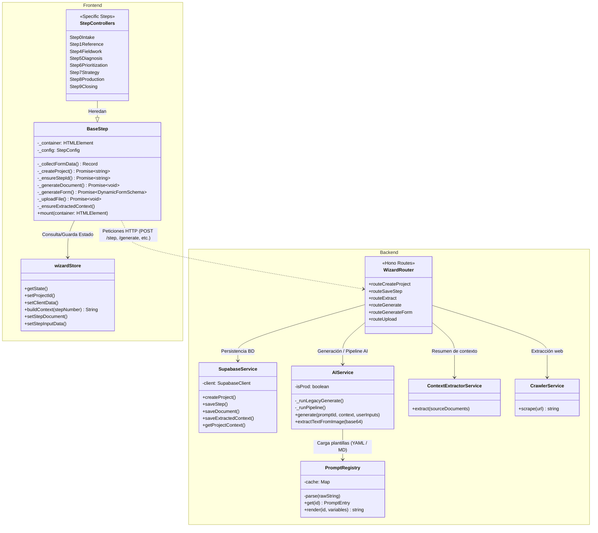

# Arquitectura del Módulo CCE (Consultoría Empresarial EC0249)

Este documento detalla el funcionamiento interno, diagrama de clases, flujo de datos y la integración progresiva de inteligencia artificial multi-agente en el módulo CCE.

## 1. Diagrama de Clases (Frontend y Backend)



---

## 2. Descripción del Frontend (Clase por Clase)

### `BaseStep`
Es la clase abstracta fundamental de la que heredan todos los pasos de la secuencia del wizard.
- **Función principal**: Controla el ciclo de vida de la vista de un paso. Gestiona los botones ("Generar", "Guardar", "Copiar"), recolecta los datos de los formularios (`_collectFormData()`), y orquesta las peticiones a la API.
- **Flujo**: Extrae la información de los inputs HTML, llama opcionalmente a compactar contexto anterior (`_ensureExtractedContext`), y lanza `_generateDocument()` que invoca al backend.

### `Step0Intake`, `Step1Reference`, etc. (Controladores)
Heredan de `BaseStep`. Cada controlador está atado a una fase (`PhaseId`) y a un Prompt específico (`promptId` ej. `F0`, `F1_1`, `F2`). Se inyectan en `main.ts` y se configuran con su plantilla de vista.

### `wizardStore`
Maneja el estado central de la interfaz de usuario.
- Construye el **Contexto de IA** interactivo (`buildContext`), uniendo los datos de los pasos pasados (nombres, sector, datos previos) y creando un solo objeto consolidado para inyectar en los Prompts de los siguientes pasos.

---

## 3. Descripción del Backend (Clase por Clase)

### `WizardRouter` (Rutas)
Construido usando Cloudflare Workers y `Hono`.
- Recibe peticiones HTTP, valida el esquema con `Zod`, e instancia el servicio apropiado. Orquesta los endpoints para crear proyectos, guardar pasos `/step`, y solicitar documentos `/generate`.
- Atrapa interceptores especiales. Por ejemplo, si en `F0` el contexto contiene una `websiteUrl`, manda llamar pasivamente a `CrawlerService.scrape(url)` e inyecta la recolección en `context.crawlerData`.

### `SupabaseService`
Capas de persistencia seguras vía *Stored Procedures* (ej. `sp_cce_create_project`) contra Postgres/Supabase. Mantiene la consistencia del workflow impidiendo corrupción o saltos directos de fases en la base de datos externa.

### `CrawlerService`
- Servicio de ingesta y rastreo web nativo (sin headless browsers densos, puro `fetch` + `cheerio`). Descarga una web, limpia de HTML la basura inyectable y extrae únicamente texto vital mitigado y truncado a 6,000 límites de caracteres (protección tokens limitados) de cara al pipeline final de la IA.

### `ContextExtractorService` y el Mapa Estructural (`flow-map.json`)
Previene el desbordamiento gradual del contexto evitando pasar en texto plano los megabits generados paso tras paso.
1. `flow-map.json` dicta "Reglas" para cada extracción (`EXTRACTOR_X`); indica de qué Fase extraer y mediante qué Patrón (`regex`).
2. Usa `extractMarkdownSection()` recorriendo por Regex nativo cada archivo para capturar la precisión pura de encabezados como "## 3. CAUSA RAÍZ IDENTIFICADA".
3. **AI Fallback**: Si el Regex falla (ej. porque un LLM alteró un encabezado en la renderización anterior), acude a una red extrayente AI de reserva en modo Temperatura *0*, operando con alta fidelidad para salvaguardar la exactitud del texto extraído.

### `AIService`
Es el puente dual de Inteligencia Artificial (Workers AI en Producción, Ollama en Desarrollo Local).
En lugar de una pasarela simple, discrimina la ejecución:
- `_runPipeline()`: Estrategia dominante actual **Multi-Agente**. Detecta un array en la especificación del `.md` (YAML frontal) encadenando agentes (Extractor `->` Especialista `->` Juez), pasando el output de uno como Input sucesorio de la misma llamada unificada.
- `_runLegacyGenerate()`: Estrategia legada en modo "Un Solo Reflejo" para prompts más cortos no estructurados.

### `PromptRegistry`
Motor lector de plantillas `/src/cce/prompts/templates`. A través del parser `gray-matter`, rompe el formato dictado en YAML Metadata conteniendo `id`, `pipeline_steps` o validaciones y un Content para uso de Handlebars estándar (ej. `{{userInputs}}`).

---

## 4. Flujo de Datos: Persistencia

En el CCE, la app no almacena los datos de entidades separadas (como tabla Cliente, tabla Diagnóstico). El flujo está atado al avance cronológico del "Expediente".

1. **Recolección en Frontend**: El usuario rellena un formulario en un "Paso" (ej. F0).
2. **`POST /step`**: Llama a `/wizard/step` pasando el JSON en bruto capturado (`inputData`).
3. **`SupabaseService.saveStep`**: Ejecuta `sp_cce_save_step` guardando la traza histórica.
4. **`POST /generate`**: Se activa la orquestación, inyecta `CrawlerData` (si hay red en ingesta), junta el resultado compactado del `ContextExtractorService` y dispara el `AIService.generate()`.
5. **`SupabaseService.saveDocument`**: La generación en su última etapa purifica y formatea para la base de datos a través de `sp_cce_save_document`.

---

## 5. Funcionamiento y Uso de los "Prompts" (La Arquitectura Multi-Agente)

El sistema de "Prompts" de CCE se fundamenta ahora en un enrutamiento de agentes cognitivos "Prompt Chaining" para mejorar sustancialmente el cumplimiento de rúbricas metodológicas (Ej: Normativas NOM y EC0301/EC0249) y purgar completamente síntomas de alucinación textual.

1. **Formatos (YAML + MD)**: Guardados en `/backend/src/cce/prompts/templates`. El documento `.md` establece las directivas al fondo, pero su encabezado YAML define `pipeline_steps`:
    ```yaml
    ---
    id: F2
    type: pipeline
    pipeline_steps:
      - agent: specialist
        task: "Lee el contexto enfocado en brechas..."
      - agent: judge
        rules:
          - "Verifica que existan exactamente 6 headers Markdown."
    ---
    ```
2. **Inyección Handlebars (`render`)**: Al ensamblar el pedido, se aplican inyecciones limpias de variables pre-estructuradas (`{{context}}`, `{{userInputs}}`).
3. **Múltiples Nodos en Serie**:
   - **`agent: extractor`**: Aísla el JSON sucio extrayendo solo contexto enfocado (síntomas de marca, problemas).
   - **`agent: specialist`**: Reemplaza al generador monolítico actuando con personalidades estrictas (ej. "Consultor Normativo STPS"). Acata la guía del `Content` del template.
   - **`agent: judge` (Auditor Final)**: Ejerce el último candado de garantía, puliendo y dictaminando sobre reglas inviolables de integridad del markdown antes del retorno (vital para permitir enganche eficaz hacia el Regex del `flow-map`).
4. **Generación de UI Dinámica (JSON Forms)**: Pasos críticos retornan su forma como Schema JSON (`DynamicFormSchema`) sin emitir texto descriptivo, lo cual acciona una capa del motor Hono al frontend (`/generate-form`) que autoconstruye controles interactivos para los consultores.
