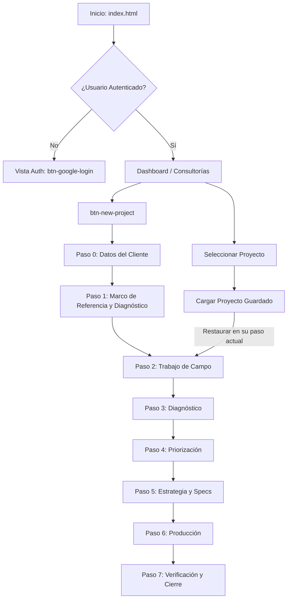
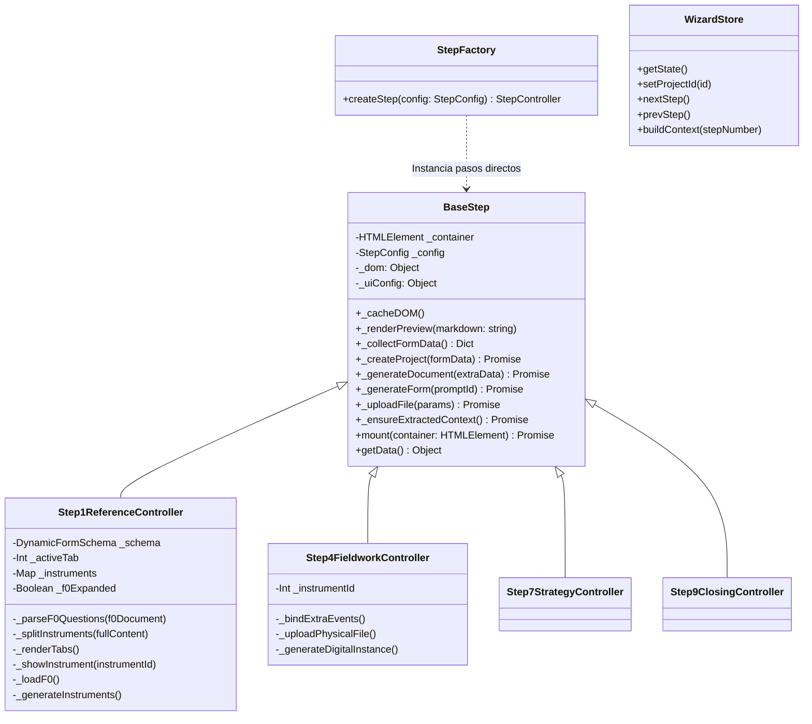

# Diagramas del Frontend - CCE

Este documento detalla la arquitectura, diagramas de flujo y diagramas de clases del frontend del módulo CCE (Consultoría Empresarial).

## 1. Diagrama de Flujo Principal (Frontend)

El flujo principal está controlado por el orquestador (`main.ts`) y la gestión de estado (`wizardStore`). El proyecto consta de 8 pasos visibles para el usuario.

### Tabla de Pasos

| stepNumber | Nombre | phaseId | pipeline |
|:---|:---|:---|:---|
| 0 | Datos del Cliente | INTAKE | No |
| 1 | Marco de Referencia | F0 | Sí (pipeline) |
| 2 | Trabajo de Campo | F1_1 + F1_2_FIELDWORK | Parcial (solo IA en generación) |
| 3 | Diagnóstico | F1_2 | Sí (pipeline) |
| 4 | Priorización | F2 | Sí (pipeline con paralelismo) |
| 5 | Estrategia y Especificaciones | F2_5 + F3 | Sí (2 pipelines separados) |
| 6 | Producción | F4 | Sí (sub-wizard de 7 productos) |
| 7 | Verificación y Cierre | F5 + F6 | Sí (2 pipelines separados) |



## 2. Diagrama de Clases

La arquitectura sigue el uso de controladores por paso (Step Controllers) que extienden o son instanciados usando la clase fundamental (`BaseStep`).



*(Nota: Muchos pasos como el 0, 3, 4 y 6 son tan directos que utilizan el `StepFactory` para crear una abstracción de `BaseStep` pasando únicamente sus configuraciones específicas).*

## 3. Entradas (Inputs) y Botones por Paso

A continuación, se detalla qué *inputs* hay, qué botones tiene cada pantalla, para qué sirven y qué información envían.

### Paso 0: Datos del Cliente (Intake - Step0Intake)
- **Indicador Adicional:** `crawlerStatus` que muestra "Analizando sitio web..." (este proceso se ejecuta antes de generar F0).
- **Inputs:** 
  - Identificación y Ubicación: `projectName`, `captureDate`, `companyName`, `tradeName`, `mainActivity`, `sector`, `city`, etc.
  - Síntomas y Problemas: `mainProblem`, `symptoms`, `problemStart`, `quantitativeData`, `previousAttempts`, `currentSituation`.
  - Obligaciones y Recursos: `hasIMSS`, `hasDC2`, `hasTrainingBudget`, `hasLMS`, etc.
  - Expectativas y Contacto: `mainObjective`, `timeframe`, `clientName`, `email`.
  - Redes: `websiteUrl`, `socialMediaUrls`, etc.
- **Botones:** 
  - `btn-submit`: *"Generar Marco de Referencia con IA"*. Valida los datos -> Crea el proyecto en Base de Datos -> Genera el documento inicial (F0).
  - Botones genéricos de base: `btn-copy-doc` (Copia el doc generado), `btn-regenerate` (Envía inputs para reensamblar IA), `btn-print`.

### Paso 1: Marco de Referencia y Diagnóstico (Step1Reference)
- **Inputs:** 
  - Formulario Dinámico (`#dynamic-form-container`) generado según las preguntas (Sección 8) del documento F0.
- **Botones:**
  - `btn-toggle-f0`: Expande/colapsa el documento F0.
  - `btn-generate-instruments`: Recolecta las respuestas capturadas y llama el prompt para generar instrumentos de evaluación (F1_1).
  - Pestañas `instrument-tab`: Alternan visualmente el instrumento renderizado.

### Paso 2: Trabajo de Campo (Step4Fieldwork)
- **Inputs:** 
  - Físicos: `#file-input` (Carga de archivos en PDF, JPG, PNG).
  - Digitales (Modal): `#digital-person-name`, `#digital-person-role`, `#digital-application-date`.
- **Botones:**
  - `btn-add-digital-instance`: Abre un modal de registro de aplicación.
  - `btn-save-digital-instance`: Envía los datos capturados y genera la instancia.
  - `btn-save-fieldwork`: Completa la recolección y avanza al siguiente estado.

### Paso 3: Diagnóstico (Step5Diagnosis)
- **Inputs:**
  - `fieldSummary`: Resumen de los hallazgos observados en campo.
  - `criticalAreas`: Áreas críticas a destacar en la organización.
- **Botones:**
  - `btn-submit`: Toma ambos inputs y genera el Reporte de Diagnóstico general (F1_2).

### Paso 4: Priorización (Step6Prioritization)
- **Inputs:**
  - `priorityCriteria`: Criterios base exigidos (Urgencia, Impacto, Frecuencia).
  - `maxInterventions`: Cantidad máxima de intervenciones a realizar (1-20).
  - `timeHorizon`: Horizonte de tiempo planificado.
- **Botones:**
  - `btn-submit`: Genera la matriz/reporte de Priorización (F2).

### Paso 5: Estrategia y Especificaciones (Step7Strategy)
- **Inputs:**
  - (Fase Estrategia): `modality`, `methodologies`, `availability`.
  - (Fase Especificaciones): `techResources`, `detailedBudget`, `facilitators`.
- **Botones:**
  - `btn-submit`: Genera la estrategia (F2_5).
  - `btn-submit-specs`: Genera las especificaciones finales que se presentarán para validación (F3).

### Paso 6: Producción (Step8Production - SUB-WIZARD)
Reemplaza la generación de un solo documento con un sub-wizard de 7 productos en cascada.
- **Flujo:**
  - Producto 1/7: PAC (Formato DC-2)
  - Producto 2/7: Carta descriptiva
  - ...
  - Producto 7/7: Reporte ejecutivo
- **Inputs:**
  - Modificado a un listado interactivo con progreso (ej. "Producto 3 de 7").
- **Botones por Sub-producto:**
  - `[Generar]`: Ejecuta el pipeline para ese sub-producto específico mostrando progreso constante.
  - `[Aprobar]`: Marca el output como definitivo en `cce_step_outputs` (approved: true) y desbloquea el siguiente paso.
  - `[Regenerar]`: Limpia el output y re-ejecuta. Si estaba aprobado, pierde la aprobación.
  - Avanzar sin aprobar lanza Modal UI advirtiendo decisión.

### Paso 7: Verificación y Cierre (Step9Closing)
- **Inputs:**
  - (Plan de Pruebas): `successCriteria`, `measurementTools`.
  - (Reporte de Pruebas): Generado de forma dinámica al renderizar el test plan.
  - (Ajustes): `adjustmentObservations`, `adjustmentResponsibles`.
- **Botones:**
  - `btn-submit`: Para generar el plan original (F5).
  - `btn-save-test-report`: Registra respuestas de prueba.
  - `btn-submit-adjustments`: Realiza el rediseño adaptativo post-pruebas (F6).
  - `btn-save-closing`: Llama al backend para el cierre de la consultoría.

---

### Output Intermedio (Debug)
En la parte inferior de cada paso con un **pipeline** largo (F0, F1_2, F2, F4), se incluye un acordeón expandible:

```markdown
▼ Outputs intermedios (debug)
  ├── extractor_web (2026-04-09 10:30:01)
  │   └── { "sector": ... }
  ├── specialist_a (2026-04-09 10:30:05)
  │   └── ...
```
*(Esta sección se muestra por defecto colapsada y requiere permisos de debug, e.g. `?debug=1`).*
